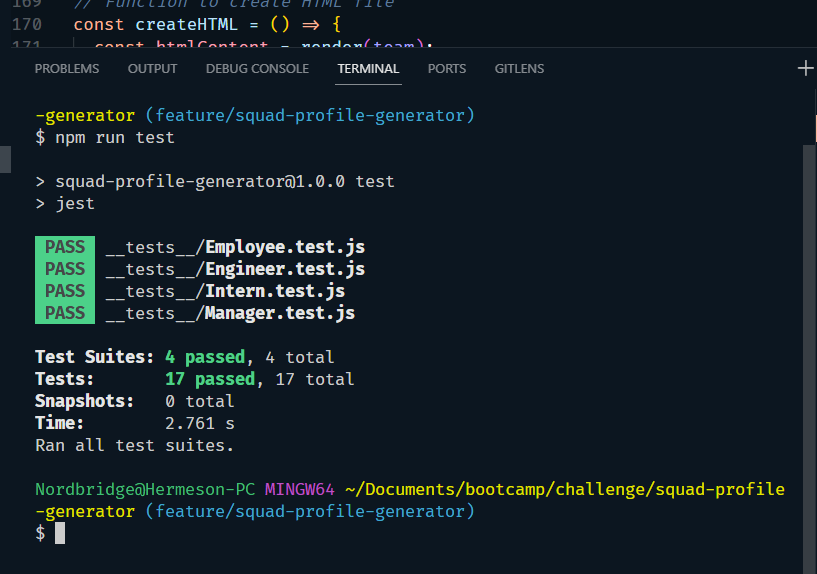

# Squad Profile Generator

## Description

I leveraged Node.js to create a command-line application that utilizes Jest for unit testing and Inquirer for user input. This application efficiently gathers information about team members in software engineering. Upon user input, it dynamically generates an HTML webpage showcasing summaries for each team member, complete with their emails and GitHub profiles. Execution is seamless with the simple command 'node index.js,' ensuring smooth operation and alignment with user story requirements."

## Demo

## Screenshots

 [squad-profile-generator.webm](https://github.com/francis-gomes-esq/squad-profile-generator/assets/152029704/ddbf2b38-da6a-4700-940c-f50f142783a5)

## Screenshots

## Features

-   User Input Handling: Collects information from the user in a structured manner using inquirer prompts, facilitating interaction with the programme.

-   Dynamic HTML Generation: Constructs HTML content dynamically based on user input, providing a visual representation of the team members.

-   Object-Oriented Programming (OOP): utilises classes and objects to encapsulate data and behaviours, promoting code organisation and reusability.

-   Asynchronous Control Flow: Utilises promises and asynchronous functions to manage the flow of operations, enhancing responsiveness and efficiency.

-   Modularization: Separates functionalities into different modules and files, promoting code organisation, maintainability, and reusability.

-   File System Interaction: Interacts with the file system to create directories and write generated HTML content to a file, facilitating data persistence and output.

## Table of Contents

-   [Demo](#demo)
-   [Screenshots](#screenshots)
-   [Features](#features)
-   [Installation](#installation)
-   [Usage](#usage)
-   [License](#license)
-   [List of Third Party Assets](#list-of-third-party-assets)
-   [Contributing](#contributing)
-   [Tests](#tests)
-   [Questions](#questions)

## Installation

1. Clone the repository

2. Run this command in your Terminal to install dependencies.

    - `npm install` or `npm i`

## Usage

1. Navigate to the project directory

2. Run this command in your Terminal

    - `node index.js`

## License

The Squad profile generator operates under license. For licencing details, click here: [MIT License](https://github.com/francis-gomes-esq/squad-profile-generator?tab=MIT-1-ov-file).

## List of third-party assets.

-   [Node.js version @6.5.0](https://nodejs.org/docs/latest/api/fs.html)
-   [Inquirer.js](https://www.npmjs.com/package/inquirer)

## Contributing

Contributors are welcome to fork repo, enhance code, and commit changes. Create PR, adhere to licence terms, provide a clear description, and collaborate responsibly

## Tests

-   Run tests with this command

    -   `npm run test`

## Questions

Contact me here for any questions [@francis-gomes-esq](https://github.com/francis-gomes-esq) or email me [figomesokoye@protonmail.com](mailto:figomesokoye@protonmail.com)

---

© 2024 Francis Gomes-Okoye.
